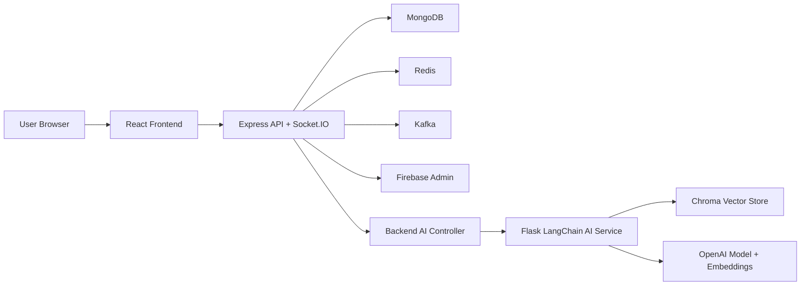
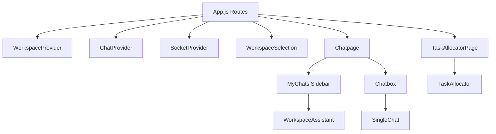
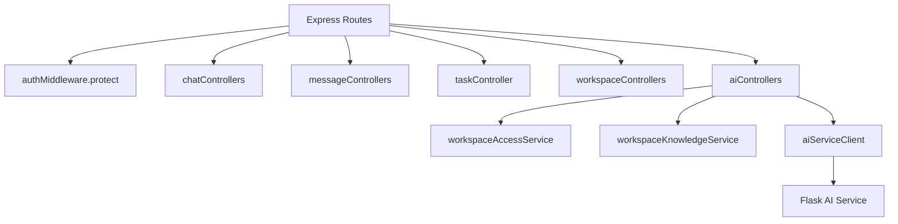
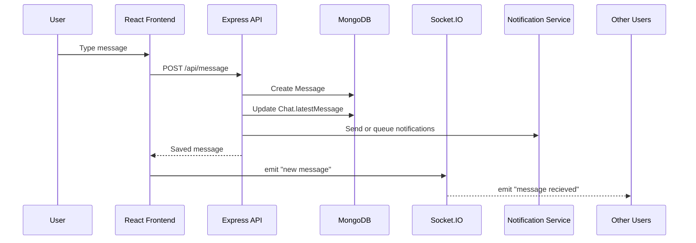
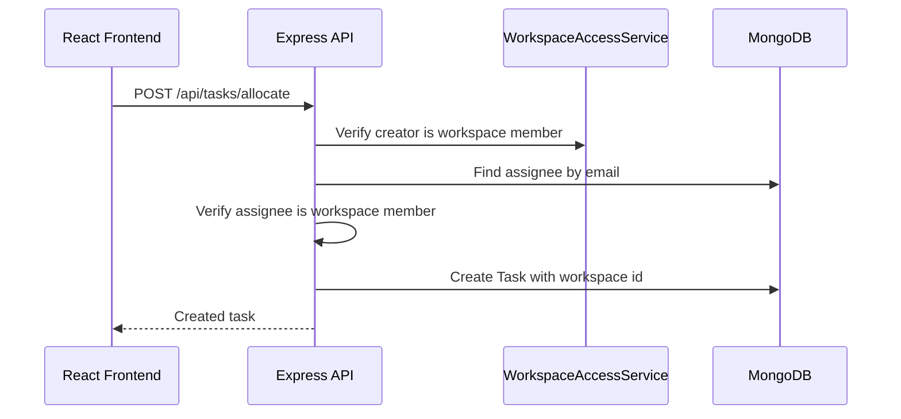
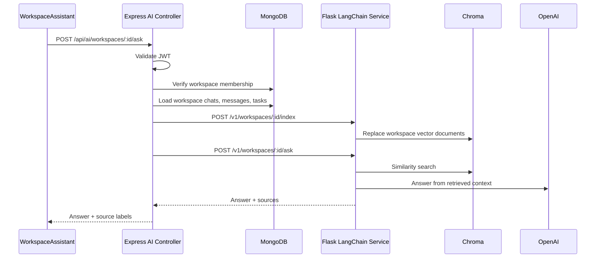
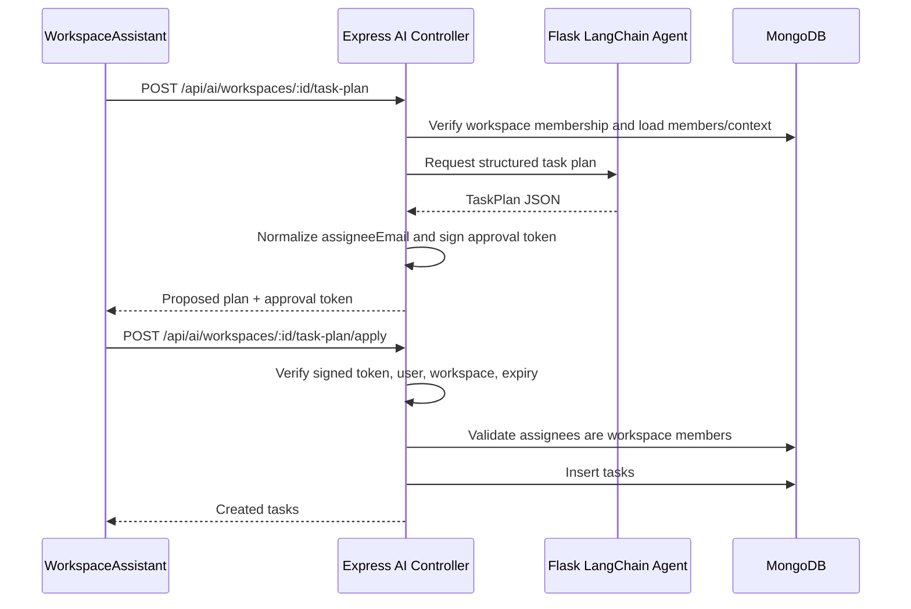

# ComConnect Architecture Guide

This guide explains how ComConnect works end to end: the frontend, backend,
data stores, real-time chat, notifications, workspace task management, and the
LangChain-powered workspace AI assistant.

## 1. System Overview

ComConnect is a workspace collaboration and event-organization application. A
user creates or joins a workspace, communicates in workspace chats, allocates
tasks, tracks status, receives notifications, and can ask an AI assistant to
summarize workspace knowledge or draft task plans.



The main design choice is that the Flask AI service is not trusted with user
identity. Express remains the security gateway: it authenticates users, checks
workspace membership, gathers only allowed workspace data, and calls the
internal AI service.

## 2. Runtime Containers

The Docker Compose stack includes:

- `frontend`: React app on port `3000`.
- `backend`: Express, REST API, Socket.IO, task allocation, notifications, and
  AI gateway on port `5000`.
- `ai-service`: Flask, LangChain, OpenAI, and Chroma-backed RAG on port `5001`.
- `mongodb`: local MongoDB for users, workspaces, chats, messages, and tasks.
- `redis`: notification/cache support.
- `zookeeper` and `kafka`: event streaming infrastructure for notifications.

Persistent volumes:

- `mongodb_data`: MongoDB data.
- `chroma_data`: AI vector index storage.

## 3. Frontend Components



Key frontend responsibilities:

- `WorkspaceSelection`: create, join, and navigate to workspaces.
- `MyChats`: lists workspace chats and provides navigation to tasks, map, and
  the AI assistant.
- `SingleChat`: loads messages, sends messages, handles typing state, and opens
  the manual task allocation dialog.
- `WorkspaceAssistant`: modal with two modes:
  - Ask Workspace: sends a question to `/api/ai/workspaces/:id/ask`.
  - Plan Tasks: generates a proposed task plan and applies it only after user
    approval.
- `TaskAllocator`: creates manual tasks and shows task status grouped by state.

## 4. Backend Components



Important backend modules:

- `authMiddleware.js`: validates JWT and attaches `req.user`.
- `workspaceAccessService.js`: verifies that a user belongs to the requested
  workspace.
- `taskController.js`: creates and updates tasks, scoped by workspace.
- `workspaceKnowledgeService.js`: builds RAG documents from workspace metadata,
  chat messages, and tasks.
- `aiServiceClient.js`: calls the Flask service with the internal
  `X-Service-Token`.
- `aiControllers.js`: owns workspace authorization, index refresh, AI ask flow,
  task-plan generation, and task-plan approval.

## 5. Data Model

Core collections:

- `User`: name, email, password hash, profile image, workspaces, FCM token.
- `Workspace`: name, creator, roles, users, associated group chats.
- `Chat`: users, group/admin info, latest message, associated workspace.
- `Message`: sender, content, chat, read status.
- `Task`: heading, description, assignee, creator, workspace, status, priority,
  comments, attachments.

The new `workspace` field on `Task` is important. It allows RAG, task lists,
and AI-generated task creation to remain scoped to one workspace.

## 6. Chat Flow



The persisted message becomes part of the workspace knowledge base the next
time the assistant syncs or answers a question.

## 7. Manual Task Flow



Task queries accept `workspaceId` and check membership before returning scoped
results.

## 8. RAG Assistant Flow



RAG documents are built from:

- workspace name and roles
- up to 1000 latest messages from workspace chats
- up to 500 latest workspace tasks and comments

The backend computes a fingerprint of the workspace documents. If content has
not changed in the current backend process, it avoids unnecessary re-indexing.

## 9. Task Planning Agent Flow



The agent never writes directly to MongoDB. It returns a structured proposal.
The backend creates tasks only after explicit approval from the user.

## 10. AI Service Internals

The Flask service exposes internal-only routes:

```text
POST /v1/workspaces/:workspaceId/index
POST /v1/workspaces/:workspaceId/ask
POST /v1/workspaces/:workspaceId/task-plan
GET  /health
```

All `/v1` routes require `X-Service-Token`. The frontend never calls Flask
directly.

LangChain pieces:

- `OpenAIEmbeddings`: creates embeddings for Chroma.
- `Chroma`: stores one vector collection per workspace.
- `ChatOpenAI`: answers RAG questions.
- `create_agent`: creates the task planning agent.
- `TaskPlan` and `PlannedTask`: Pydantic schemas enforce structured agent
  output, including maximum 20 tasks.

Prompt safety:

- The assistant is instructed to answer only from retrieved workspace context.
- Retrieved workspace content is treated as untrusted data.
- The task agent is told not to claim task creation and to assign only listed
  workspace members.

## 11. Security Boundaries

Security rules implemented:

- JWT required for all Express `/api/ai/*` routes.
- User must be a workspace member before sync, ask, plan, or apply.
- Flask AI routes require internal service token.
- AI-generated task plans are signed with `JWT_SECRET` and expire after 30
  minutes.
- Applying a task plan re-validates user id, workspace id, task count, and
  assignees.
- The AI service receives only workspace-scoped documents selected by Express.

Operational security requirements:

- Replace default `JWT_SECRET`.
- Replace default `AI_SERVICE_TOKEN`.
- Set `OPENAI_API_KEY`.
- In production, do not expose port `5001` publicly.
- Configure Firebase credentials through `FIREBASE_SERVICE_ACCOUNT_PATH` or
  `FIREBASE_SERVICE_ACCOUNT_JSON`.

## 12. Failure Modes

- Missing `OPENAI_API_KEY`: AI health remains OK, but ask/index/plan fails when
  embeddings or model calls are attempted.
- AI service down: Express returns an AI-service error to the assistant modal.
- Workspace not found or unauthorized: Express rejects the request before any AI
  call.
- Invalid task-plan approval token: Express rejects the apply request.
- Assignee not in workspace: generated tasks are not created.
- Firebase credentials missing: Firebase uses application default credentials;
  notification delivery may fail in local environments, but backend startup no
  longer depends on a hard-coded JSON file.

## 13. How To Run

Create `.env` from `.env.example` and set secrets:

```bash
docker compose up --build
```

Useful health checks:

```bash
curl http://localhost:3000
curl http://localhost:5000/health
curl http://localhost:5001/health
```

## 14. Verification Checklist

For a complete local verification:

1. `docker compose config --quiet`
2. `docker compose build ai-service backend frontend`
3. `docker compose up -d mongodb redis zookeeper kafka ai-service backend frontend`
4. `docker compose ps`
5. `curl http://localhost:5001/health`
6. `curl http://localhost:5000/health`
7. `curl http://localhost:3000`
8. `docker compose run --rm --no-deps frontend npm run build`
9. Run AI service smoke checks for health and service-token behavior.

Full semantic AI behavior requires a valid `OPENAI_API_KEY`. Without it, the
service can be built and health-tested, but OpenAI embedding/model calls cannot
complete.
