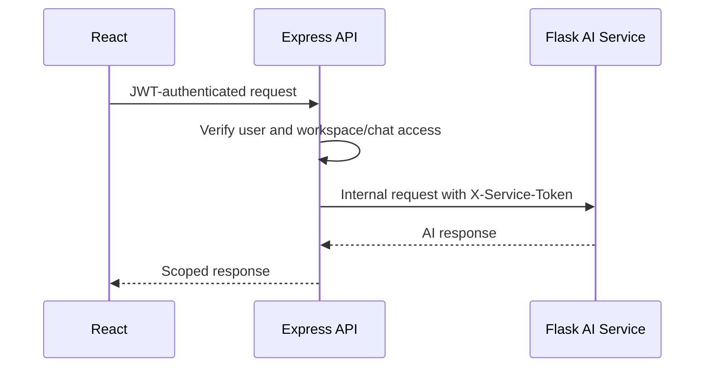
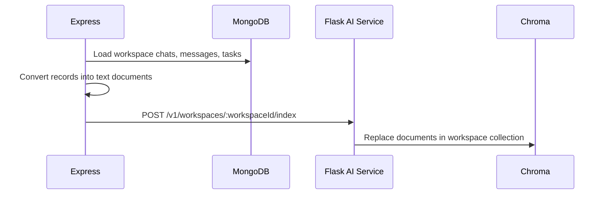
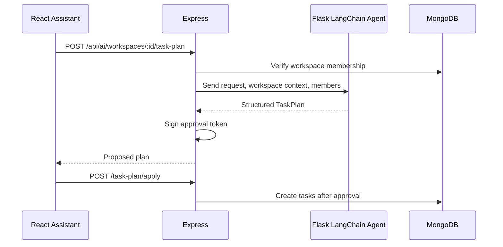
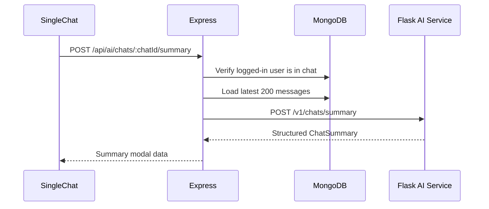
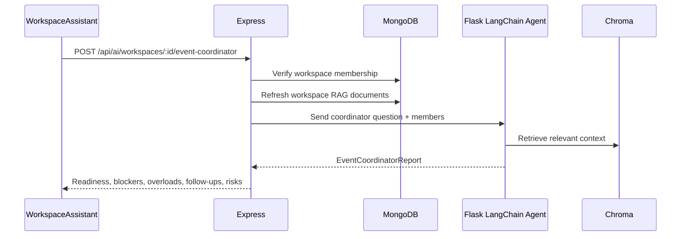

# Workspace AI Workflows

This document explains how the AI features in ComConnect work in code and at
runtime. It covers:

- workspace-scoped RAG
- task planning agent
- group chat summarizer
- event coordinator agent

## 1. Tech Stack

AI service:

- Flask for the internal AI HTTP service
- LangChain for model orchestration and agent-style structured outputs
- `langchain-openai` for `ChatOpenAI` and `OpenAIEmbeddings`
- Chroma for per-workspace vector storage
- Pydantic for structured AI outputs

Main app:

- React and Chakra UI for the assistant UI
- Express for authenticated API routes
- MongoDB and Mongoose for workspace, chat, message, and task data
- Socket.IO for real-time chat
- Docker Compose for containerized local development

## 2. Security Model

The frontend never calls the Flask AI service directly.



Why this matters:

- The AI service does not decide who can read workspace data.
- Express sends only data the logged-in user is allowed to access.
- Internal AI routes require `X-Service-Token`.
- Generated task plans must be approved before tasks are created.

## 3. Workspace-Scoped RAG

Workspace RAG lets users ask questions like:

```text
What decisions were made about the event budget?
Which logistics tasks are still pending?
What was discussed this week about registration?
```

### Data Used

The backend builds documents from:

- workspace name and roles
- recent workspace chat messages
- workspace tasks, task status, assignees, and comments

Snippet from `backend/services/workspaceKnowledgeService.js`:

```js
const [messages, tasks] = await Promise.all([
  Message.find({ chat: { $in: chatIds } })
    .sort({ createdAt: -1 })
    .limit(1000)
    .populate("sender", "name")
    .lean(),
  Task.find({ workspace: workspace._id })
    .sort({ updatedAt: -1 })
    .limit(500)
    .populate("assignee createdBy comments.user", "name email")
    .lean(),
]);
```

Each document is sent to the Flask service:

```js
const result = await indexWorkspace(workspaceId, documents);
```

### RAG Indexing Flow



### How Embeddings Are Stored

The app does not store raw embeddings in MongoDB. MongoDB remains the source of
truth for business data. The AI service converts workspace documents into
embeddings and stores those vectors in Chroma.

Step by step:

1. Express loads authorized workspace data from MongoDB.
2. Express converts each message/task/workspace record into plain text.
3. Express sends those documents to the internal Flask route.
4. Flask creates one Chroma collection per workspace.
5. Chroma calls `OpenAIEmbeddings` to convert text into vectors.
6. Chroma stores each vector with metadata like source type, label, and source
   id.

Document example sent from Express to Flask:

```json
{
  "id": "task-665f...",
  "content": "Task: Confirm auditorium booking\nDescription: Call admin office...\nStatus: to-do\nAssignee: Priya <priya@example.com>\nComments: None",
  "metadata": {
    "type": "task",
    "label": "Confirm auditorium booking",
    "source_id": "665f..."
  }
}
```

Flask stores each workspace in its own Chroma collection:

```py
def workspace_store(workspace_id):
    return Chroma(
        collection_name=_collection_name(workspace_id),
        embedding_function=_embeddings(),
        persist_directory=current_app.config["CHROMA_DIR"],
    )
```

This means workspace A and workspace B do not share a vector collection. A query
inside one workspace retrieves only that workspace's indexed context.

When a workspace is re-indexed, the current implementation replaces that
workspace collection's documents:

```py
existing = store.get(include=[])
if existing["ids"]:
    store.delete(ids=existing["ids"])

store.add_documents(documents=documents, ids=ids)
```

The backend also computes a content fingerprint before indexing. If messages and
tasks have not changed in the current backend process, it can skip unnecessary
re-embedding.

### Ask Flow

Frontend call:

```js
await axios.post(
  `${API_URL}/ai/workspaces/${workspaceId}/ask`,
  { question },
  { headers: { Authorization: `Bearer ${user.token}` } }
);
```

Express route:

```text
POST /api/ai/workspaces/:workspaceId/ask
```

Internal Flask route:

```text
POST /v1/workspaces/:workspaceId/ask
```

LangChain prompt behavior:

- retrieve relevant Chroma documents
- answer only from workspace context
- return source labels
- ignore instructions embedded inside retrieved messages/tasks

Snippet from `ai-service/app/chains.py`:

```py
documents = retrieve(workspace_id, question)
response = _model().invoke([
    SystemMessage(content="You are ComConnect's workspace assistant..."),
    HumanMessage(content=f"Context:\n{_context(documents)}\n\nQuestion: {question}"),
])
```

### Query-To-Answer Flow

When a user asks:

```text
What tasks are still pending for tomorrow?
```

the flow is:

1. React sends the question to Express with the user's JWT.
2. Express verifies the user belongs to the workspace.
3. Express refreshes the workspace index if the source data changed.
4. Flask embeds the user's question.
5. Chroma compares that query vector against stored message/task/workspace
   vectors.
6. Chroma returns the most similar documents.
7. Flask builds a prompt that contains:
   - system instructions
   - retrieved workspace context
   - the user's question
8. `ChatOpenAI` generates an answer using only the retrieved context.
9. Flask returns the answer plus source metadata.
10. React shows the answer and source labels in the assistant modal.

The key idea is that the LLM does not search MongoDB directly. It receives a
small, relevant context window selected by vector similarity.

Example response:

```json
{
  "answer": "The venue booking is still pending approval [2].",
  "sources": [
    { "type": "task", "label": "Confirm auditorium booking" }
  ]
}
```

## 4. Task Planning Agent

The task planner turns a natural-language request into a structured task plan.

Example prompt:

```text
Create a practical launch plan for the registration desk.
```

### Planner Flow



### How Planning Uses RAG

The task planner uses the same workspace RAG index, but instead of answering a
question directly, it creates a structured plan.

For a request like:

```text
Plan all tasks needed for tomorrow's registration desk.
```

the service retrieves context about:

- current registration-related chat messages
- existing pending registration tasks
- workspace roles and members
- comments that mention blockers or deadlines

That context is passed to a LangChain `create_agent` call with a Pydantic output
schema. The schema forces the response to be machine-readable instead of loose
chat text.

The AI output is constrained by Pydantic:

```py
class PlannedTask(BaseModel):
    heading: str
    description: str
    assignee_email: str | None = None
    priority: Literal["low", "medium", "high"] = "medium"

class TaskPlan(BaseModel):
    summary: str
    tasks: list[PlannedTask]
```

Important behavior:

- The agent does not create tasks directly.
- Express signs the plan with `JWT_SECRET`.
- The approval token expires after 30 minutes.
- Express re-checks workspace membership and assignee membership before insert.

Example frontend apply request:

```js
await axios.post(
  `${API_URL}/ai/workspaces/${workspaceId}/task-plan/apply`,
  { approvalToken },
  { headers: { Authorization: `Bearer ${user.token}` } }
);
```

Example planned task:

```json
{
  "heading": "Prepare registration desk QR scanner",
  "description": "Set up scanner laptop, test QR flow, and keep charger ready.",
  "assigneeEmail": "member@example.com",
  "priority": "high"
}
```

## 5. Chat Summarizer

The chat summarizer is simpler than a full agent and makes group chats more
useful immediately. It appears as a `Summarize Chat` button in group chat
headers.

Useful outputs:

- short summary
- action items
- unresolved questions
- people mentioned
- deadlines

### Summarizer Flow



Frontend button:

```jsx
{selectedChat.isGroupChat && (
  <ChatSummaryButton chatId={selectedChat._id} />
)}
```

Backend validation:

```js
if (!chat.users.some((chatUser) => chatUser._id.toString() === req.user._id.toString())) {
  res.status(403);
  throw new Error("You do not have access to this chat");
}
if (!chat.isGroupChat) {
  res.status(400);
  throw new Error("Chat summarizer is available for group chats");
}
```

Structured output schema:

```py
class ChatSummary(BaseModel):
    short_summary: str
    action_items: list[str]
    unresolved_questions: list[str]
    people_mentioned: list[str]
    deadlines: list[str]
```

Example response:

```json
{
  "summary": {
    "short_summary": "The team discussed registration desk setup and scanner testing.",
    "action_items": [
      "Test QR scanner before event day",
      "Arrange backup laptop"
    ],
    "unresolved_questions": [
      "Who will handle the second shift?"
    ],
    "people_mentioned": ["Aman", "Priya"],
    "deadlines": ["before 9 AM"]
  }
}
```

## 6. Event Coordinator Agent

The Event Coordinator Agent answers operational questions for event organizers:

```text
Are we ready for the event?
What is blocked?
Who has too many tasks?
Which tasks need follow-up?
```

It uses:

- task status
- chat activity
- workspace members
- RAG-retrieved workspace context

### Coordinator Flow



Frontend call:

```js
await axios.post(
  `${API_URL}/ai/workspaces/${workspaceId}/event-coordinator`,
  { question: "What is blocked?" },
  { headers: { Authorization: `Bearer ${user.token}` } }
);
```

Structured output schema:

```py
class EventCoordinatorReport(BaseModel):
    answer: str
    readiness: Literal["ready", "mostly_ready", "at_risk", "blocked", "unknown"]
    blocked_items: list[str]
    overloaded_members: list[str]
    follow_up_tasks: list[str]
    risks: list[str]
```

Example response:

```json
{
  "report": {
    "answer": "The event is mostly ready, but venue confirmation and volunteer shifts need follow-up.",
    "readiness": "mostly_ready",
    "blocked_items": ["Venue booking approval"],
    "overloaded_members": ["Priya has 5 open logistics tasks"],
    "follow_up_tasks": ["Confirm second-shift volunteers"],
    "risks": ["Registration desk may be understaffed after lunch"]
  }
}
```

## 7. Current UI Locations

Workspace assistant:

- Location: chat sidebar
- Button: `AI Assistant`
- Tabs:
  - `Ask Workspace`
  - `Plan Tasks`
  - `Event Coordinator`

Chat summarizer:

- Location: group chat header
- Button: `Summarize Chat`
- Opens a modal with summary sections

## 8. Required Environment Variables

```env
OPENAI_API_KEY=your-openai-key
OPENAI_MODEL=gpt-4.1-mini
AI_SERVICE_TOKEN=replace-with-an-internal-service-token
JWT_SECRET=replace-with-a-long-random-secret
```

Without `OPENAI_API_KEY`, containers and smoke tests still run, but embeddings
and model calls cannot complete.

## 9. Verification Commands

```powershell
docker compose config --quiet
docker compose build ai-service backend frontend
docker compose run --rm --no-deps frontend npm run build
docker compose run --rm --no-deps -e AI_SERVICE_TOKEN=test-token ai-service python tests/smoke_check.py
docker compose up -d mongodb redis zookeeper kafka ai-service backend frontend
```

Health checks:

```powershell
Invoke-RestMethod http://127.0.0.1:5001/health
Invoke-RestMethod http://127.0.0.1:5000/health
Invoke-WebRequest -UseBasicParsing http://127.0.0.1:3000
```
